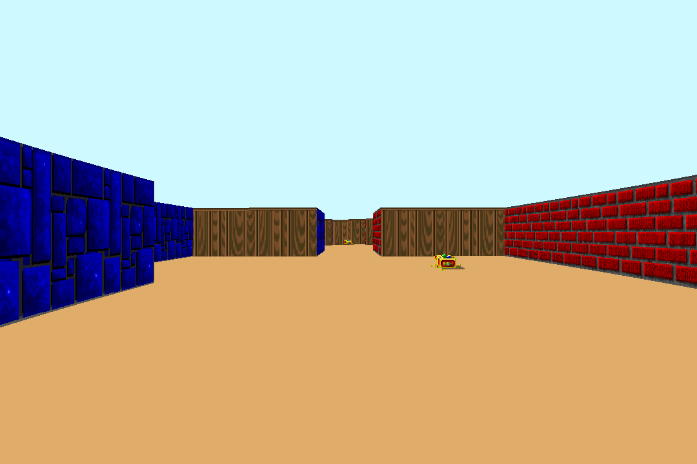

# Getting started

```shell
make
```
```shell
./cub3D map.cub
```

# Controls

* WASD to move, Left/Right directional keys to rotate camera
* M to toggle minimap
* ESC to quit
* Textures or colors for each sides (North, South, West, East) and Sky/Floor
